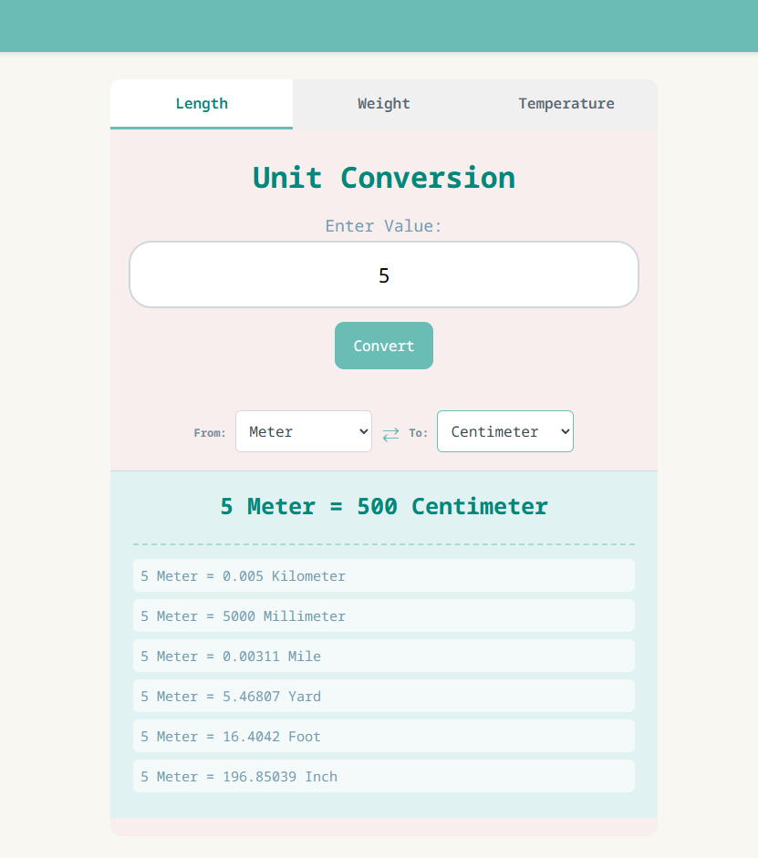
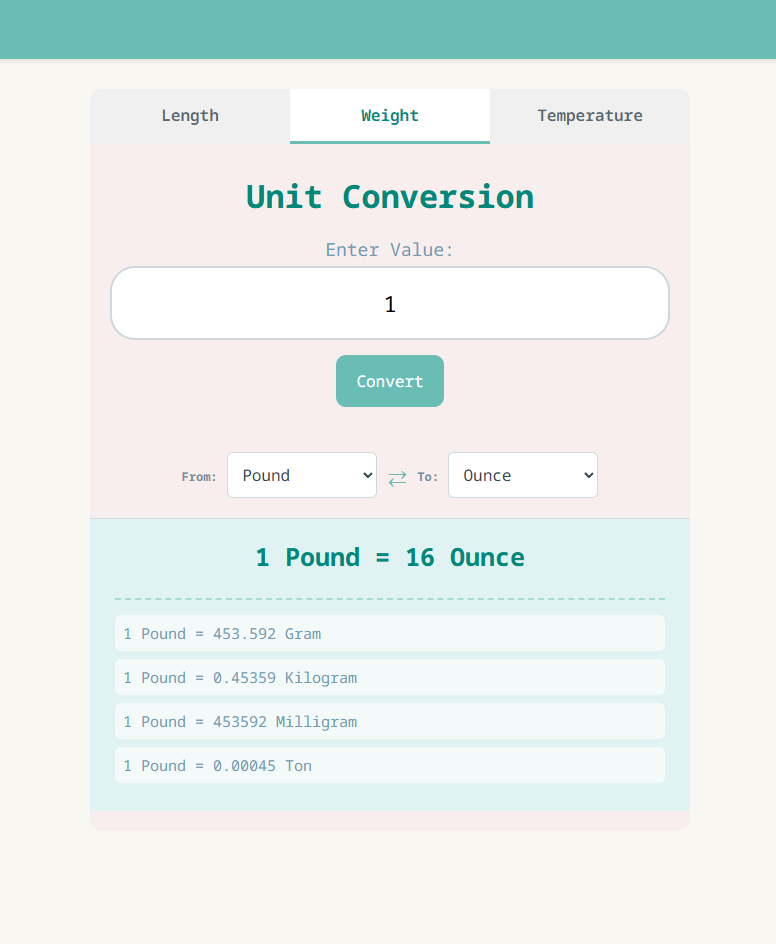
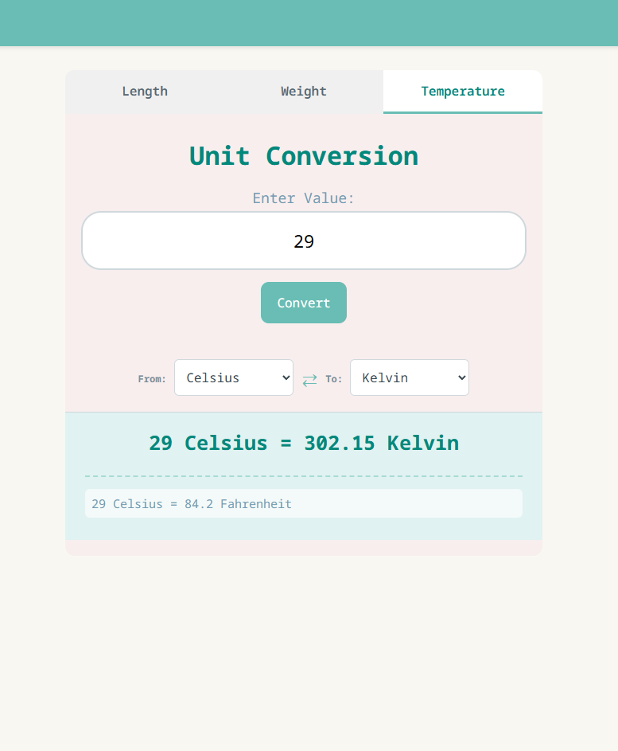

# Unit Converter

*A modern, web-based unit conversion tool built with **HTML**, **CSS**, and **JavaScript**. This project allows users to convert between various metric and imperial units for Length, Weight, and Temperature.

  

## Features

* Convert units for Length, Weight, and Temperature by switching between tabs.
* Instantly calculates the conversion for the selected unit.
* Automatically calculates and lists conversions for other available units in that category, not just the target unit.
* Easily swap "From" and "To" units with a single click.
* Clean and modern UI.

## 📸 Screenshots

### Weight Conversion
Shows a detailed list of all corresponding weight units.

### Temperature & UI
Clean interface with "Arbutus" font typography.

## Technologies
**HTML5** - **CSS3** - **JavaScript**

This is a student project. Suggestions and improvements are welcome!
*Developed by Berke İkikarakayali*
